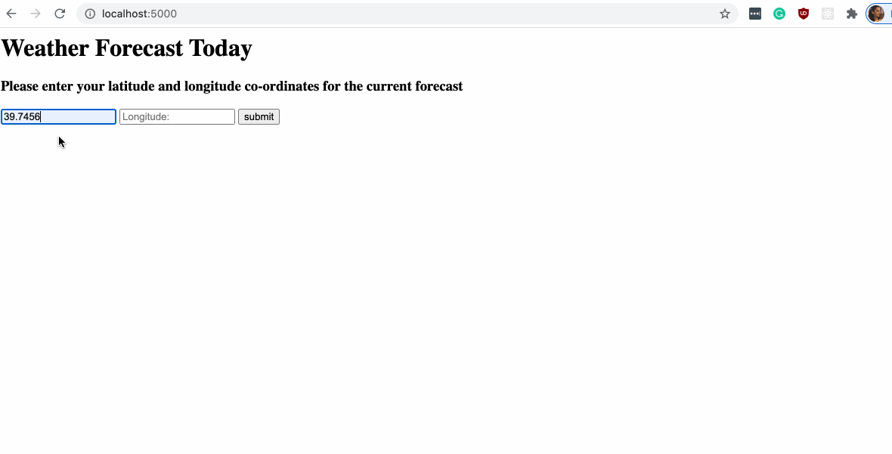

***Bringing up the server:***

from the root directory ```/weather_api``` run 
```bash
python server.py
```

open up ```http://localhost:5000/``` in your preffered browser. 

enter your choice of co-ordinates and view weather on the same page.

